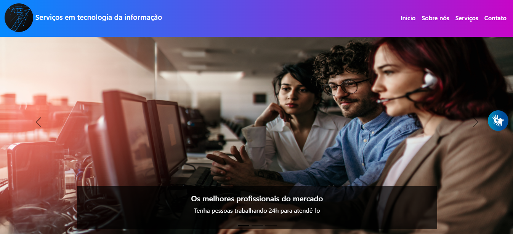

# SE7I - Serviços em tecnologia da informação
Projeto referente a empresa SE7I construída durante o TCC de suporte em TI.

## 💻 Link para acessar o site
> https://se-7i.vercel.app

### 🏠 Página principal
>Na página inicial têm em destaque um carousel de imagens, com um texto chamativo para nossos serviços. 
Ao descer a página, há uma seção que apresenta nossos serviços e que possui um link para a página de serviços. 
Em seguida há um efeito parallax com uma imagem e um slogan com efeito do plugin typed.js. 
Por último foi adicionada uma seção para destacar depoimentos de clientes que utilizaram nossos serviços.

### 7️⃣ Sobre nós
>Na página sobre nós há de cara um título animado com uma imagem e um texto ao lado contando sobre a história da empresa. 
Logo abaixo têm três cards que detalham os príncipios da SE7I. 
Ao rolar o site, há um efeito parallax com uma imagem chamativa para apresentar o conteúdo que irá ser abordado a seguir. 
Em seguida, há uma seção que detalha a fundo o programa social da empresa chamado IPIM. 
Por último, têm uma seção para apresentar toda a equipe que realizou TCC, e um efeito animado no título.

### ⚙️ Serviços
> Na página de serviços, há um título chamativo que apresenta nossos serviços através de três cards: Hardware, Software e Redes. 
> Logo abaixo, foi implementado um formulário de solicitação de orçamento com um plano de fundo em formato de gif.

### 🌐 Contato
> Na página contato há um formulário para entrar em contato com a empresa. 
> Ao lado deste formulário foi adicionado um mapa contendo o endereço da SE7I. 
> Neste formulário foi aplicado a validação dos campos com Javascript. 
> Neste mesmo formulário há um efeito que ao clicar no botão, é exibido um alerta de sucesso ao enviar.

## 🚀 Tecnologias e ferramentas utilizadas
- <b>HTML5:</b> linguagem de marcação de texto utilizada para estruturar o site;
- <b>CSS3:</b> linguagem utilizada para estilização de elementos;
- <b>Bootstrap:</b> Framework utilizada para facilitar na construção do site, como: formulários, cards, barra de navegação, rodapé, etc;
- <b>JQuery:</b> biblioteca javascript que simplifica a sintaxe e disponibiliza outros recursos;
- <b>Javascript:</b> linguagem de programação utilizada para dar interatividade ao site;
  - <b>OwlCarousel:</b> plugin para criar carousel.
  - <b>Typed.js:</b> biblioteca para adicionar animação aos textos.
  - <b>Toastr.js:</b> biblioteca para alertas interativos.
  - <b>VLibras:</b> plugin de acessibilidade em libras.
  - <b>Font Awesome:</b> biblioteca que disponibiliza ícones.
  - <b>JQuery InputMask:</b> plugin para adicionar máscaras ao formulário.
- <b>Vercel:</b> plataforma utilizada para hospedar o site.
